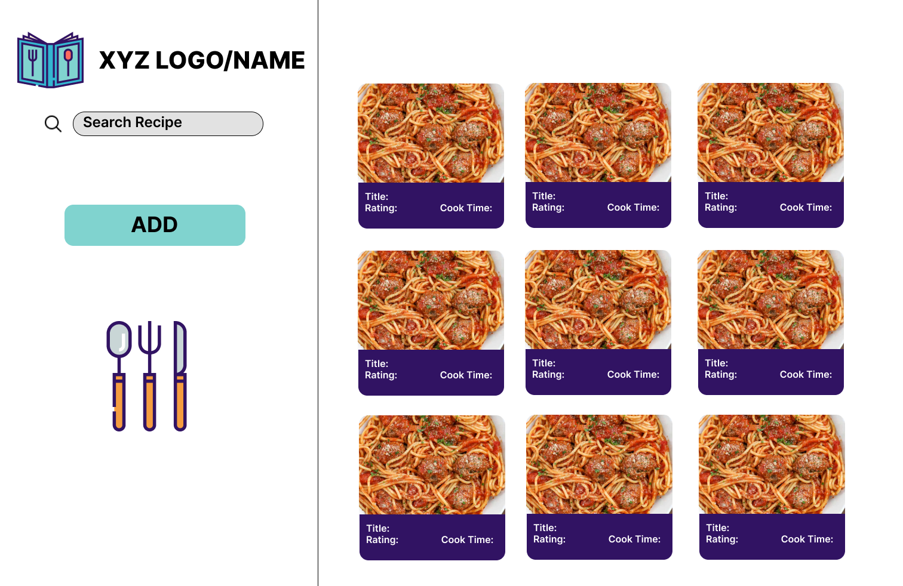

# 🧑‍🍳 Cooking Vault App 🧑‍🍳

The Cooking Vault is a intuitive web application that organizes your favorite recipes. You can view, delete, edit and create entirely new recipes that satisfy your taste buds. The goal is to have a personalized recipes at the touch of a button. Our app offers step-by-step instructions of your favorite recipes, ingredients, images, rating and cook time.

## 👩🏽‍🚀 Feature List:
* Create new recipes items to your list
* Delete recipes items from your list
* Update ingredients, directions, cook time and more
* View all recipes items stored

## 🎨 Wireframe

<div>



</div>

[Figma UX Design](https://www.figma.com/file/nVNAco9PUDnng4ziMvbCRs/Recipes-MERN-CRUD-APP?node-id=0%3A1)


## 🚀 MVP:
The primary goal is to make an web application that allows users to efficiently maintain a library of recipes. Our app will feature  creation, deletion, and editing processes that will make cataloging recipes seamless for the user. We ensure responiveness and the user's experience is kept in mind when creating this application. You can visit our site on devices including mobile, laptop, tablet and more.


## 🥳 Post MVP (Extras)
* Dynamic rating component
* Recipe Search Query
* Google Images API
* Sort read items
* Parsing rating in hours and minutes
* Addition of favorites field by boolean
* Google Authentication for personalized experience

## 🔨 Back-end Endpoints
Routes:
* view all: "/recipes"
* create new: "/recipes"
* update one: "/recipes/:id"
* delete: "/recipes/:id"

## 🗒️ Component Hierarchy
```
  src/
    components/
        routes/
            ShowRecipe.js
            CreateRecipe.js
            EditRecipe.js
            ListRecipes.js
            Home.js
            LandPage.js
            Search.js
        shared/
            RecipeForm.js
            Footer.js
            Layout.js
            Loading.js
            RecipeCard.js
            RouteView.js
            SideNav.js
    ...
```
## 📦 List Dependencies 

Front-End:
* Axios
* HTML
* CSS

Backend:

* JavaScript
* Netlify
* Node.js
* Express
* MongoDB


## 👨‍💻 Authors
* [Amar Moorer](https://github.com/Amoorer75)
* [George Sucuzhanay](https://github.com/George-Sucuzhanay)
* [Braun Payne](https://github.com/qu3stion)
